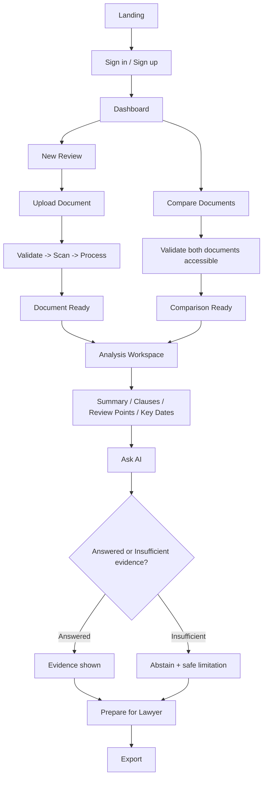

# Application Flow Specification
## Product: ClauseIQX

**Version:** 2.0 (Final Merged)
**Companion to:** PRD, UI/UX Design, Backend Schema

---

## 1. Global Flow



---

## 2. Authentication Flow

```text
Open app
 ├─ authenticated → Dashboard
 └─ unauthenticated → Login → Sign up / Sign in / Reset access
```

Security requirements:
- Never reveal whether an email/account exists during account recovery.
- Rate-limit authentication attempts; account lockout/abuse controls.
- Rotate sessions after authentication (new session on login, not reused).
- Authorization is enforced server-side on every protected resource, every request — never inferred from client state.

---

## 3. Create Project Flow

```text
Dashboard → New Review → Create Project
  ├─ Project title
  ├─ Jurisdiction (optional — "unknown" stored if skipped, never guessed)
  └─ Document type (optional)
→ Upload → Project created
```

---

## 4. Document Upload Flow

```text
Select file
 → client-side basic validation
 → upload
 → server authentication + authorization
 → declared + detected MIME/type/size/page validation
 → quarantine storage
 → malware scan
     ├─ failed → safe error, delete/retry, never partially processed
     └─ passed ↓
 → text extraction
     ├─ failed → error + alternate upload guidance
     └─ succeeded ↓
 → structure detection → chunking → embedding
 → Document Ready
```

---

## 5. Analysis Flow

```text
Document Ready
 → generate analysis job
 → retrieve structured sections
 → generate summary
 → detect notable clauses (Review Points)
 → extract dates/obligations
 → validate citations
     ├─ failed → analysis marked incomplete, not shown as done
     └─ passed ↓
 → persist analysis → show workspace
```

The UI must never present analysis as complete before citation validation succeeds for every finding.

---

## 6. Question Answering Flow

```text
User asks question
 → input validation
 → safety/high-stakes classification
     ├─ high-stakes/outcome-prediction request → contextual warning
     │      + what the document says + what's unknown + questions for a professional
     │      (never a dead-end refusal)
     └─ standard informational question ↓
 → query rewrite / retrieval planning
 → hybrid retrieval (semantic + keyword, scoped to this document/project only)
 → reranking
 → evidence sufficiency check
     ├─ insufficient → abstain + explain limitation + suggest what would help
     └─ sufficient ↓
 → LLM generation (evidence explicitly untrusted-data-labeled)
 → schema validation
 → citation validation
     ├─ invalid → regenerate once (bounded), then fail safely
     └─ valid ↓
 → persist answer + evidence references
 → stream/display answer
```

---

## 7. Comparison Flow

```text
Choose Compare
 → select Document A + Document B
 → verify both accessible to this user
 → normalize documents
 → align sections
 → structural diff
 → materiality classification
 → LLM explanation (grounded, dual-source)
 → source validation (citation exists in both A and B as claimed)
 → comparison report
```

Rules: preserve original documents (never overwrite either source); label "Document A"/"Document B" unless the user explicitly designates old/new; never infer chronology from upload order.

---

## 8. Export Flow

```text
Click Export
 → select output format
 → generate export job
 → render report (includes disclaimer + generation timestamp + source references)
 → verify report metadata
 → store in private artifact storage
 → short-lived authorized download link
 → download
```

Never create public/permanent file URLs. Deleted resources can never be exported.

---

## 9. Delete Flow

```text
Delete project/document
 → confirmation (states what will be deleted, without exposing unnecessary content)
 → authorize request
 → mark deleted
 → delete/queue source object deletion
 → delete chunks/embeddings
 → delete derived analyses
 → delete exports
 → audit deletion event (metadata only, never raw content)
```

Deletion is idempotent — retrying a delete request is always safe.

---

## 10. Permission Failure Flow

```text
Request resource
 → authenticated?
     ├─ no → 401
     └─ yes → ownership/role check
                 ├─ no → 404 or 403, consistently per resource type (non-enumerating)
                 └─ yes → continue
```

Prefer non-enumerating responses wherever revealing resource existence itself creates risk (e.g., "does this document exist" for another tenant).

---

## 11. AI Failure Flow

**Provider timeout:**
```text
AI request → timeout → bounded retry policy
   ├─ success → continue
   └─ failure → user-friendly error (never silently substitute fabricated content)
```

**Invalid model output:**
```text
Model output → JSON/schema validation
   ├─ valid → citation validation
   └─ invalid → one bounded repair attempt → fail safely if still invalid
```

---

## 12. High-Stakes Flow

```text
Question → high-stakes classifier → contextual warning
   → what the document says
   → what remains unknown
   → questions/facts to take to a professional
```

Never terminate with a dead-end refusal when safe, useful assistance can still be given.

---

## 13. Navigation State

Project-level tabs: Overview · Clauses · Review Points · Key Dates · Ask · Compare · Lawyer Prep.

Deep links preserve: `project_id`, `document_id`, selected clause, selected source page. Never expose authorization-sensitive information solely through URL parameters (server still re-checks authorization on every deep-linked request).

---

## 14. State Machines

**Background jobs:** `QUEUED → RUNNING → SUCCEEDED | FAILED_RETRYABLE | FAILED | CANCELLED`

**Documents:** `UPLOADING → QUARANTINED → SCANNING → PROCESSING → READY | FAILED | DELETED`

---

## 15. Multi-Document / Project-Level Q&A

Within a project containing multiple related documents (e.g., lease + amendment + notice letter), Ask can operate at the project level: retrieval spans chunks from all documents in the project, and every citation indicates **which document** it came from, not just a page number — avoiding ambiguity when several documents are in play.

---

## 16. App-Level Invariants

1. No document analysis without a successfully scanned source.
2. No AI answer without a retrieval/evidence-sufficiency evaluation.
3. No source citation unless the source actually exists and matches the claimed document version.
4. No cross-user/cross-tenant document access, under any circumstance.
5. No export of deleted documents.
6. No client-side authorization decisions — server re-validates every time.
7. No active file content (macros/scripts) is ever executed.
8. No irreversible external action is triggered solely by model output without independent application-level authorization.

---

## 17. Production Deployment Flow

```text
Developer / CI
   │
   ▼
npm run deploy
   │
   ├─ 1. Build `@clauseiqx/web` Next.js static production bundle (Turbopack)
   ├─ 2. Target Firebase Project: `clauseiqx`
   └─ 3. Upload & release to Firebase Hosting
         │
         ▼
Live Production Site: https://clauseiqx.web.app
```

