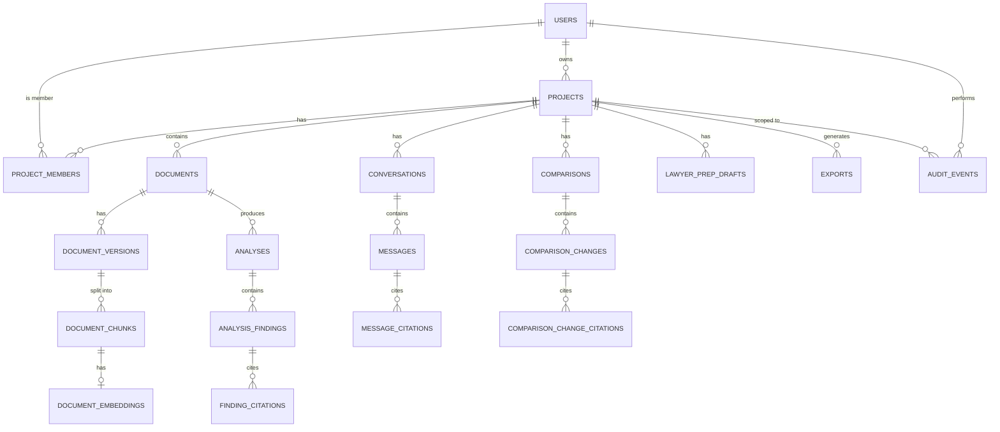

# Backend Schema & Data Model
## Product: ClauseIQX

**Version:** 2.0 (Final Merged)
**Database:** PostgreSQL 15+ with `pgvector`

---

## 1. Schema Principles

- UUID primary keys everywhere; never guessable sequential IDs for public-facing resources.
- `created_at`/`updated_at` on all mutable entities.
- Foreign keys with explicit deletion semantics (cascade where the child has no independent lifecycle).
- Database-level constraints for invariants, not just application-level checks.
- Ownership fields are always server-generated — never accepted from client input.
- Soft deletion only where operationally useful (undo window); physical/cryptographic deletion follows the documented retention policy afterward.
- Never store raw secrets in application tables; never log document text or full prompt/response content.

---

## 2. Entity Relationship Overview



---

## 3. Users

```sql
users (
  id uuid primary key,
  email citext unique not null,
  display_name text,
  auth_provider text not null,
  status text not null,
  created_at timestamptz not null,
  updated_at timestamptz not null
)
```
- Email uniqueness enforced.
- Do not store plaintext passwords if using an external identity provider.
- Do not store provider access tokens unless strictly required; use encrypted secret storage if so.

---

## 4. Projects

```sql
projects (
  id uuid primary key,
  owner_user_id uuid not null references users(id),
  name text not null,
  jurisdiction_code text,          -- null/"unknown" if user skips, never guessed
  document_type text,
  status text not null,
  created_at timestamptz not null,
  updated_at timestamptz not null,
  deleted_at timestamptz
)
```
Indexes: `(owner_user_id, created_at desc)`, `(owner_user_id, status)`.

### 4.1 Project Members (optional team sharing — PRD FR-32)
```sql
project_members (
  id uuid primary key,
  project_id uuid not null references projects(id),
  user_id uuid not null references users(id),
  role text not null,              -- 'owner' | 'member' | 'viewer'
  invited_at timestamptz not null,
  accepted_at timestamptz,
  unique(project_id, user_id)
)
```

---

## 5. Documents

```sql
documents (
  id uuid primary key,
  project_id uuid not null references projects(id),
  uploaded_by_user_id uuid not null references users(id),
  filename text not null,
  media_type text not null,
  byte_size bigint not null check (byte_size > 0),
  sha256 text not null,
  status text not null,            -- see App Flow §14 document state machine
  page_count integer check (page_count >= 0),
  storage_object_key text,         -- never guessable
  scan_status text not null,
  created_at timestamptz not null,
  updated_at timestamptz not null,
  deleted_at timestamptz
)
```
Do not make `storage_object_key` predictable/derivable from document ID alone.

---

## 6. Document Versions

```sql
document_versions (
  id uuid primary key,
  document_id uuid not null references documents(id),
  version_number integer not null,
  content_sha256 text not null,
  extractor_version text not null,
  language_code text,
  extraction_status text not null,
  created_at timestamptz not null,
  unique(document_id, version_number)
)
```
Purpose: allow extractor/model upgrades without losing provenance of what produced which analysis.

---

## 7. Document Chunks

```sql
document_chunks (
  id uuid primary key,
  document_version_id uuid not null references document_versions(id),
  chunk_index integer not null,
  text_content text not null,
  page_start integer,
  page_end integer,
  section_title text,
  char_start integer,
  char_end integer,
  extraction_confidence numeric(5,4),
  metadata jsonb not null default '{}',
  created_at timestamptz not null,
  unique(document_version_id, chunk_index)
)
```
Never write chunk `text_content` to general-purpose application logs.

---

## 8. Embeddings (separate table — supports multiple models per chunk without mutating chunk provenance)

```sql
document_embeddings (
  chunk_id uuid not null references document_chunks(id),
  embedding_model text not null,
  embedding vector(<MODEL_DIMENSION>),   -- dimension is configuration-driven, matches selected model
  created_at timestamptz not null,
  primary key (chunk_id, embedding_model)
)
```

---

## 9. Analyses

```sql
analyses (
  id uuid primary key,
  document_id uuid not null references documents(id),
  analysis_type text not null,      -- 'summary' | 'clauses' | 'review_points' | 'dates' | ...
  model_provider text,
  model_name text,
  prompt_version text not null,
  status text not null,             -- 'pending' | 'processing' | 'ready' | 'incomplete' | 'failed'
  result jsonb,
  created_at timestamptz not null,
  completed_at timestamptz
)
```
Store prompt/template **version identifiers**, not full prompts containing sensitive user content. `status='incomplete'` when citation validation fails — never surfaced to the UI as "ready."

---

## 10. Analysis Findings

```sql
analysis_findings (
  id uuid primary key,
  analysis_id uuid not null references analyses(id),
  finding_type text not null,       -- obligation | right | date | fee | termination |
                                     -- liability | indemnity | privacy | dispute |
                                     -- inconsistency | review_point
  confidence text,                  -- 'high' | 'medium' | 'low'
  title text not null,
  explanation text not null,
  created_at timestamptz not null
)
```
Note: `severity`/color-only labeling deliberately avoided at the schema level to match the UI/UX principle of never implying a legal verdict — `finding_type` + `explanation` + citations carry the meaning.

### 10.1 Finding Citations (auditable provenance — mandatory, never optional)
```sql
finding_citations (
  finding_id uuid not null references analysis_findings(id),
  chunk_id uuid not null references document_chunks(id),
  primary key (finding_id, chunk_id)
)
```
Application layer must reject persisting an `analysis_finding` with zero citations.

---

## 11. Conversations & Messages

```sql
conversations (
  id uuid primary key,
  project_id uuid not null references projects(id),
  user_id uuid not null references users(id),
  title text,
  created_at timestamptz not null,
  updated_at timestamptz not null
)

messages (
  id uuid primary key,
  conversation_id uuid not null references conversations(id),
  role text not null,               -- 'user' | 'assistant' | 'system_metadata'
  content text not null,
  status text not null,             -- includes 'abstained' for evidence-insufficient answers
  model_name text,
  prompt_version text,
  created_at timestamptz not null
)
```
`system_metadata` messages are never exposed to the user.

```sql
message_citations (
  id uuid primary key,
  message_id uuid not null references messages(id),
  chunk_id uuid not null references document_chunks(id),
  relevance_score numeric,
  created_at timestamptz not null
)
```

---

## 12. Comparisons

```sql
comparisons (
  id uuid primary key,
  project_id uuid not null references projects(id),
  document_a_id uuid not null references documents(id),
  document_b_id uuid not null references documents(id),
  status text not null,
  model_name text,
  prompt_version text,
  summary jsonb,
  created_at timestamptz not null,
  completed_at timestamptz,
  check (document_a_id <> document_b_id)
)

comparison_changes (
  id uuid primary key,
  comparison_id uuid not null references comparisons(id),
  change_type text not null,        -- added | removed | modified | reordered | paraphrased
  materiality text not null,        -- e.g. 'material' | 'minor' | 'formatting_only'
  title text not null,
  explanation text not null,
  old_text text,
  new_text text,
  created_at timestamptz not null
)

comparison_change_citations (
  change_id uuid not null references comparison_changes(id),
  chunk_id uuid not null references document_chunks(id),
  source_side text not null,        -- 'a' | 'b'
  primary key (change_id, chunk_id, source_side)
)
```

---

## 13. Lawyer Prep Drafts

```sql
lawyer_prep_drafts (
  id uuid primary key,
  project_id uuid not null references projects(id),
  created_by_user_id uuid not null references users(id),
  situation_summary text,
  key_clauses jsonb,
  key_dates jsonb,
  facts_still_needed jsonb,
  questions_for_lawyer jsonb,
  user_notes text,
  status text not null,             -- 'draft' | 'finalized'
  created_at timestamptz not null,
  updated_at timestamptz not null
)
```
User-editable before export; never labeled a legal opinion/case assessment anywhere in schema, API, or UI copy.

---

## 14. Exports

```sql
exports (
  id uuid primary key,
  project_id uuid not null references projects(id),
  requested_by_user_id uuid not null references users(id),
  export_source_type text not null,  -- 'summary' | 'comparison' | 'lawyer_prep'
  format text not null,              -- 'pdf' | 'docx' | 'markdown' | 'ics'
  status text not null,
  storage_object_key text,
  expires_at timestamptz,
  created_at timestamptz not null
)
```
Use short-lived authorized download URLs or an authenticated download endpoint — never a public/permanent link.

---

## 15. Audit Events

```sql
audit_events (
  id uuid primary key,
  actor_user_id uuid references users(id),
  project_id uuid references projects(id),
  event_type text not null,
  resource_type text,
  resource_id uuid,
  request_id text,
  metadata jsonb not null default '{}',
  created_at timestamptz not null
)
```
Never store full document text, prompts, model responses, or credentials in `metadata` unless explicitly justified and separately protected. `audit_events` is append-only at the DB role level (no UPDATE/DELETE grants) except a documented, logged anonymization process tied to account deletion.

---

## 16. Background Jobs

```sql
jobs (
  id uuid primary key,
  job_type text not null,
  resource_type text not null,
  resource_id uuid not null,
  status text not null,             -- QUEUED | RUNNING | SUCCEEDED | FAILED_RETRYABLE | FAILED | CANCELLED
  attempts integer not null default 0,
  last_error_code text,
  created_at timestamptz not null,
  started_at timestamptz,
  completed_at timestamptz
)
```

---

## 17. Row-Level Security

If PostgreSQL RLS is enabled (recommended as defense-in-depth beneath application authorization):
- A user may `SELECT` only projects they own or are an accepted `project_members` row for.
- Document/analysis/conversation/comparison/export access derives from project access — never checked independently of it.
- No table grants direct cross-tenant visibility, even to an application role, without an explicit policy.

Defense in depth = (1) application authorization, (2) DB constraints/RLS, (3) private storage authorization. A single-layer failure must never be sufficient for a breach.

---

## 18. Indexing Strategy

```text
projects(owner_user_id, created_at)
project_members(project_id, user_id)
documents(project_id, created_at)
document_versions(document_id, version_number)
document_chunks(document_version_id, chunk_index)
analyses(document_id, created_at)
conversations(project_id, updated_at)
messages(conversation_id, created_at)
comparisons(project_id, created_at)
audit_events(project_id, created_at)
jobs(status, created_at)
```
Vector retrieval: HNSW or IVFFlat depending on scale/operational preference; always filter by document/project scope before or alongside vector search — never search across tenants.

---

## 19. Migration Rules

Every schema change is a migration; never manually alter production schema. Migrations must be backward-compatible for rolling deploys. Large data migrations run asynchronously. Rollback strategy documented per migration. CI applies every migration to an ephemeral database before merge.

---

## 20. Data Lifecycle

```text
Upload → active → user delete / retention expiry → deletion queued
       → source removed → chunks/embeddings removed → derived outputs removed
       → audit event retained per policy
```
Backups have a documented expiry policy. Deletion is idempotent (see App Flow §9).

---

## 21. Schema Security Checklist

- [ ] No plaintext credentials anywhere
- [ ] No client-controlled owner/tenant IDs
- [ ] UUIDs used for all public identifiers
- [ ] Foreign keys enforced, not just conventionally implied
- [ ] RLS considered/enabled
- [ ] Sensitive columns (document text, prompts) excluded from debug logs
- [ ] Storage keys private and non-guessable
- [ ] Soft-delete behavior documented per table
- [ ] Deletion cascade tested end-to-end (not just declared in schema)
- [ ] Backup retention documented
- [ ] Every `analysis_findings` row has ≥1 `finding_citations` row before it can be marked ready
